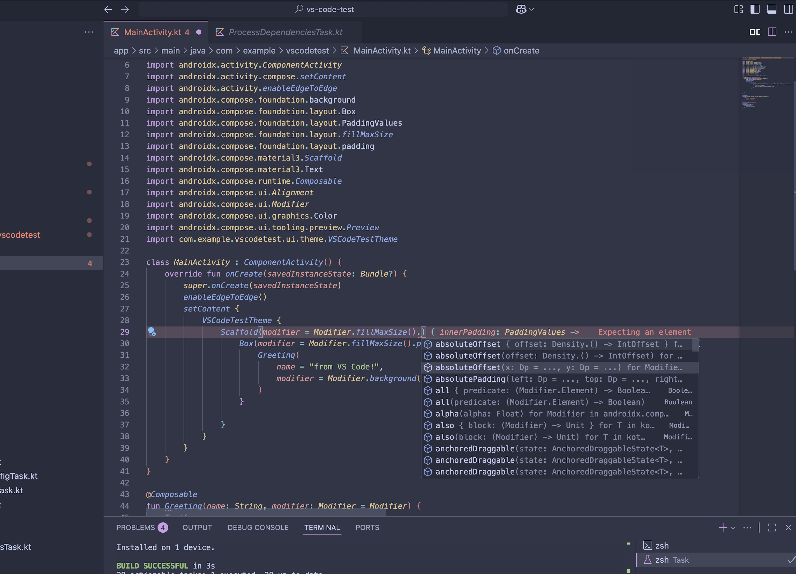

# Kotlin LSP Workspace Generator Plugin

> [!WARNING]
> Experimental project with limited functionality. Many features don't work as expected since Kotlin LSP only supports JVM targets.



## 🚀 How to Use This Plugin

This experimental plugin was created out of curiosity to explore if Android development is possible in IDEs other than Android Studio. After JetBrains released the official Kotlin Language Server Protocol (LSP), this opportunity became real.

Android Studio remains unmatched and always will be, but if you need a lightweight editor with auto-completion, auto-imports (crucial for Jetpack Compose), and type checking, this might work.

### Prerequisites
- **JAVA_HOME** environment variable set
- **javac** available on PATH

### Installation & Usage

1. **Clone this repository:**
   ```bash
   git clone git@github.com:desugar-64/kotlin-lsp-workspace-generator.git
   cd kotlin-lsp-workspace-generator
   ```

2. **Publish to Maven Local:**
   ```bash
   ./gradlew :kotlin-lsp-workspace-gradle-plugin:publishToMavenLocal
   ```

3. **Add to your Android project** (in root `build.gradle.kts`):
   ```kotlin
   // IMPORTANT: Add mavenLocal() to repositories
   pluginManagement {
       repositories {
           mavenLocal()  // Required to pick up locally published plugin
           gradlePluginPortal()
           google()
           mavenCentral()
       }
   }
   
   plugins {
       id("dev.serhiiyaremych.kotlin.lsp.workspace") version "1.0.0-SNAPSHOT"
   }
   ```

4. **Generate workspace configuration:**
   ```bash
   ./gradlew generateKotlinLspWorkspace
   # or sync Gradle project (auto-regeneration is enabled by default)
   ```

5. **Open in VS Code:**
   - Install Kotlin LSP from [GitHub releases](https://github.com/Kotlin/kotlin-lsp)
   - Open your project folder in VS Code
   - **The generated `workspace.json` provides correct dependency paths - Android AARs transformed to JARs with proper source attachments!**
   - **Use Terminal → Run Task to access Android build commands like "Android: Build Debug & Run", "Android: Install Debug", etc.**

### What You Get
The Kotlin LSP currently supports **JVM modules only** (Android/multiplatform support is on their roadmap). This plugin bridges that gap by helping Kotlin LSP understand Android project dependencies:

- **Navigate to source** of AndroidX, Compose, and other Android libraries
- **Code completion** for Android APIs and dependencies  
- **Import resolution** and suggestions for Android libraries
- **Syntax highlighting** with basic error detection

### ⚠️ Important Limitations
- **Jetpack Compose**: The plugin cannot fix Compose compiler issues. Compose uses compile-time transformations that LSP doesn't understand, so you'll see type errors (code still compiles correctly)
- **Android-specific features**: LSP doesn't understand Android manifest, resources, or build variants
- **Full IDE features**: For complete Android development, Android Studio remains the best choice

This plugin makes Kotlin LSP usable for Android projects but doesn't provide the full Android Studio experience.

---

A comprehensive Gradle plugin that generates workspace configuration files for the [JetBrains Kotlin Language Server Protocol (LSP)](https://github.com/Kotlin/kotlin-lsp), enabling advanced Kotlin development support in VS Code and other LSP-compatible editors for Android projects.

**Plugin ID**: `dev.serhiiyaremych.kotlin.lsp.workspace`  
**Extension**: `kotlinLspWorkspace { }`  
**Architecture**: Standalone Gradle plugin with composite build integration

> **📦 Migration Note**: This plugin was recently migrated from `buildSrc` to a standalone module for better versioning, distribution, and development workflow. All functionality remains identical.

## 🎯 Purpose

The **Kotlin LSP Workspace Generator Plugin** solves the problem of setting up proper IDE-like support for Android Kotlin projects in lightweight editors. It automatically generates a `workspace.json` file that the Kotlin LSP uses to:

- **Navigate to library sources** - Jump to definitions in AndroidX, Compose, and other dependencies
- **Code completion** - Intelligent autocomplete for Kotlin and Android APIs
- **Import resolution** - Automatically resolve and suggest imports
- **Syntax highlighting** - Rich Kotlin syntax highlighting and error detection
- **Cross-references** - Find usages and references across the project

### Problem Solved

Android projects have complex dependency structures with AARs, multiple source sets, SDK libraries, and Compose compiler transformations. Without proper configuration:

- LSP cannot find library JARs and source attachments
- Navigation to Android SDK sources fails
- Compose-specific types are not recognized
- Code completion is limited to project sources only

This plugin **automatically detects** your project structure and **generates the correct workspace configuration** without manual setup.

## ⚡ Quick Start

```kotlin
// build.gradle.kts
plugins {
    id("dev.serhiiyaremych.kotlin.lsp.workspace") version "1.0.0-SNAPSHOT"
}

// Generate workspace
./gradlew generateKotlinLspWorkspace
```

**⚠️ Known Issue**: Compose projects will show cosmetic type errors in LSP. See [Error Suppression](#-temporary-error-suppression) for workarounds.

## 🏗️ Architecture

The plugin implements a **4-task pipeline** that transforms a complex Android project into an LSP-compatible workspace:

```
./gradlew generateKotlinLspWorkspace
    ↓
┌─────────────────────┐
│   cleanLspTemp      │ ← Clean build directory
└─────────────────────┘
    ↓
┌─────────────────────┐
│ processLspDependencies │ ← Extract & process all dependencies
└─────────────────────┘
    ↓
┌─────────────────────┐
│ generateKotlinLspWorkspace │ ← Generate workspace.json
└─────────────────────┘
    ↓
┌─────────────────────┐
│ generateVSCodeConfig │ ← Generate VS Code config (optional)
└─────────────────────┘
```

## 📋 Task Structure

### 1. `cleanLspTemp` - Preparation Task
**Purpose**: Initialize clean working directory for LSP artifacts.

**What it does**:
- Removes existing `.lsp-temp` directory from `build/`
- Creates fresh temp directory for processed dependencies
- Ensures consistent state for each workspace generation

**Source**: [`CleanLspTempTask.kt`](kotlin-lsp-workspace-gradle-plugin/src/main/kotlin/dev/serhiiyaremych/kotlin/lsp/CleanLspTempTask.kt)

```kotlin
// Simple but critical - ensures no stale artifacts
tempDir.deleteRecursively()
tempDir.mkdirs()
```

### 2. `processLspDependencies` - Core Processing Task
**Purpose**: Transform Android project dependencies into LSP-compatible JAR files and metadata.

**What it does**:
- **AAR Processing**: Extracts `classes.jar` from Android Archive files and creates properly named JARs
- **Source Attachment**: Locates and copies corresponding `-sources.jar` files
- **Android SDK Integration**: Copies Android platform JARs and creates SDK sources
- **Compose Stubs Generation**: Creates `ComposableFunction0-22` bytecode stubs for Compose compiler compatibility
- **Dependency Resolution**: Maps Gradle configurations (`implementation`, `compileOnly`) to LSP scopes
- **Path Normalization**: Copies all JARs to `.lsp-temp` for consistent absolute paths

**🔧 Recent Fixes**:
- **Fixed AAR processing bug**: Now creates properly named JAR files (e.g., `runtime-android-1.9.0.jar`) instead of directory structures
- **Fixed library name consistency**: All dependency names now match between modules and library definitions
- **Improved error handling**: Better cleanup of temporary extraction directories

**Key Functions**:
- `processAarFile(aarFile, tempDir, targetJarName)` - Extracts JARs from AAR archives with proper naming
- `addAndroidSdkLibraries()` - Integrates Android SDK
- `addComposeStubs()` - Generates Compose compiler stubs
- `collectLibrariesWithPaths()` - Processes dependency graph

**Source**: [`ProcessDependenciesTask.kt`](kotlin-lsp-workspace-gradle-plugin/src/main/kotlin/dev/serhiiyaremych/kotlin/lsp/ProcessDependenciesTask.kt) (647 lines - extracted from original 600-line monolithic task)

```kotlin
// Fixed AAR to JAR extraction with proper naming
fun processAarFile(aarFile: File, tempDir: File, targetJarName: String): File? {
    try {
        val targetJar = File(tempDir, targetJarName)
        // Extract AAR and create properly named JAR
        extractedDir = extractAarToTemp(aarFile, tempDir)
        val classesJar = File(extractedDir, "classes.jar")
        if (classesJar.exists()) {
            classesJar.copyTo(targetJar, overwrite = true)
            return targetJar
        }
    } finally {
        extractedDir.deleteRecursively() // Proper cleanup
    }
    return null
}
```

### 3. `generateKotlinLspWorkspace` - Workspace Generation Task
**Purpose**: Create the final `workspace.json` file from processed dependency metadata.

**What it does**:
- **Module Definition**: Creates module entries with source roots and dependencies
- **Library Registry**: Defines all external JARs with paths and source attachments
- **SDK Configuration**: Integrates Android SDK information
- **Kotlin Settings**: Configures Kotlin-specific LSP parameters
- **JSON Assembly**: Combines all components into proper workspace structure

**Source**: [`GenerateWorkspaceTask.kt`](kotlin-lsp-workspace-gradle-plugin/src/main/kotlin/dev/serhiiyaremych/kotlin/lsp/GenerateWorkspaceTask.kt)

```json
{
  "modules": [ /* Project modules with dependencies */ ],
  "libraries": [ /* All JARs with sources */ ],
  "sdks": [ /* Android SDK info */ ],
  "kotlinSettings": [ /* Kotlin LSP config */ ]
}
```

### 4. `generateVSCodeConfig` - IDE Integration Task (Optional)
**Purpose**: Generate VS Code-specific configuration files for seamless development experience.

**What it does**:
- **Launch Configuration**: Creates `.vscode/launch.json` for Android app debugging
- **Build Tasks**: Creates `.vscode/tasks.json` for Gradle build integration
- **Template Processing**: Uses configurable templates for custom setups

**Source**: [`GenerateVSCodeConfigTask.kt`](kotlin-lsp-workspace-gradle-plugin/src/main/kotlin/dev/serhiiyaremych/kotlin/lsp/GenerateVSCodeConfigTask.kt)

## ⚙️ Configuration API

The plugin provides a clean DSL with smart defaults and minimal required configuration:

```kotlin
kotlinLspWorkspace {
    // Core LSP Configuration
    workspaceFile.set(file("workspace.json"))          // Output location
    includeTestDependencies.set(false)                 // Include test scopes
    generateComposeStubs.set(true)                     // Compose support
    copyJarsToTemp.set(true)                          // Path consistency
    
    // Auto-regeneration
    autoRegenerate.set(true)                          // Rebuild on dependency changes
    
    // VS Code Integration
    generateVSCodeConfig.set(true)                    // Create .vscode/ files
    vsCodeDirectory.set(file(".vscode"))              // VS Code config location
    generateLaunchJson.set(true)                      // Android debugging setup
    generateTasksJson.set(true)                       // Build task integration
    mainActivityName.set("MainActivity")              // Entry point activity
}
```

## 🎮 VS Code Integration

The plugin automatically generates comprehensive VS Code task configurations for seamless Android development workflow.

### ⚙️ Terminal Tasks (Ctrl+Shift+P → "Tasks: Run Task")

Access via **Command Palette** (Ctrl+Shift+P) → type **"Tasks: Run Task"**:

#### 🏗️ Build Tasks
- **`Android: Build Debug`** ⭐ (Default)
  - Command: `./gradlew assembleDebug`
  - Builds debug APK for development
  - **Default build task** (Ctrl+Shift+B)

- **`Android: Build Debug & Run`** 🚀 (Complete Workflow)
  - **Sequence**: Install Debug → Launch App
  - Complete development cycle: build → install → launch
  - **One-click development** - most commonly used

- **`Android: Build Release`**
  - Command: `./gradlew assembleRelease`
  - Builds optimized release APK

- **`Android: Install Debug`**
  - Command: `./gradlew installDebug` 
  - Builds and installs debug APK on device
  - Depends on: `Android: Build Debug`

- **`Android: Clean Project`**
  - Command: `./gradlew clean`
  - Cleans all build artifacts
  - Use when build cache issues occur

- **`Android: Uninstall Debug`**
  - Command: `./gradlew uninstallDebug`
  - Removes debug app from device

#### 📱 Device Management Tasks  
- **`Android: List Devices`**
  - Command: `adb devices -l`
  - Shows connected devices and emulators
  - Useful for troubleshooting connections

- **`Android: Launch App`**
  - Command: `adb shell am start -n com.example.vscodetest/.MainActivity`
  - Starts app on device (if installed)
  - Quick app restart without rebuild

- **`Android: Clear App Data`**
  - Command: `adb shell pm clear com.example.vscodetest`
  - Clears app data and preferences
  - Useful for testing first-run scenarios

#### 🔍 Development Tools
- **`Android: View Logs`** 
  - Command: `adb logcat -v color`
  - Opens live device logs in dedicated terminal
  - **Background task** - runs continuously
  - Essential for debugging runtime issues

### 🎯 Quick Access Methods

| Method | Shortcut | Use Case |
|--------|----------|----------|
| **Default Build** | `Ctrl+Shift+B` | Quick debug build (`Android: Build Debug`) |
| **Run Specific Task** | `Ctrl+Shift+P` → "Tasks: Run Task" | Access any Android task |
| **Terminal** | `Ctrl+`` ` | Direct gradle/adb commands |

### 📋 Typical Development Workflow

1. **🔄 Daily Development** (Fastest):
   - **Tasks: Run Task** → `Android: Build Debug & Run` 🚀
   - **One command**: Build → Install → Launch (complete cycle)

2. **🐛 Debugging Issues**:
   - **Tasks: Run Task** → `Android: View Logs` → continuous logcat monitoring  
   - **Tasks: Run Task** → `Android: Clear App Data` → reset app state
   - **Tasks: Run Task** → `Android: List Devices` → verify device connection

3. **📦 Release Preparation**:
   - **Tasks: Run Task** → `Android: Clean Project` → clean build
   - **Tasks: Run Task** → `Android: Build Release` → production APK

4. **Manual Control**:
   - `Ctrl+Shift+B` → builds debug APK only
   - **Tasks: Run Task** → `Android: Install Debug` → build + install only

### 🚀 Complete Build & Launch Workflow
```
Ctrl+Shift+P → "Tasks: Run Task" → "Android: Build Debug & Run"
   ↓
Builds debug APK → Installs on device → Launches app
   ↓  
Ready for development/testing!
```

## 🚀 Usage Examples

### Minimal Setup (Recommended)
```kotlin
// build.gradle.kts
plugins {
    id("dev.serhiiyaremych.kotlin.lsp.workspace")
}

// That's it! Everything auto-detected.
```

### Custom Configuration
```kotlin
plugins {
    id("dev.serhiiyaremych.kotlin.lsp.workspace")
}

kotlinLspWorkspace {
    workspaceFile.set(file("custom-workspace.json"))
    includeTestDependencies.set(true)      // Include test libraries
    generateComposeStubs.set(false)        // Skip if not using Compose  
    autoRegenerate.set(false)              // Manual regeneration only
    
    // Custom VS Code setup
    generateVSCodeConfig.set(true)
    mainActivityName.set("CustomMainActivity")
}
```

### Manual Task Execution
```bash
# Generate workspace only
./gradlew generateKotlinLspWorkspace

# Generate with VS Code config
./gradlew generateVSCodeConfig

# Clean and regenerate everything
./gradlew cleanLspTemp generateKotlinLspWorkspace

# See all available tasks
./gradlew tasks --group="kotlin lsp workspace"
```

## 🔍 Auto-Detection Features

The plugin automatically detects and configures:

| Component | Detection Method | Fallback |
|-----------|------------------|----------|
| **Android SDK** | `local.properties` → `ANDROID_HOME` → common paths | Skip SDK integration |
| **Compile SDK Version** | Android Gradle Plugin extension | Default to API 36 |
| **Kotlin Version** | Applied plugins and dependencies | Use 2.0.21 |
| **Compose Usage** | Compose compiler plugin detection | Generate stubs anyway |
| **Project Structure** | Gradle project model | Standard Android layout |
| **Dependencies** | All Gradle configurations | `implementation` + `compileOnly` |

## 📁 Generated Artifacts

### Build Directory Structure
```
build/
├── .lsp-temp/                           # Processed dependencies
│   ├── android-36.jar                   # Android SDK
│   ├── android-36-sources.jar           # SDK sources  
│   ├── compose-function-stubs.jar       # Compose compatibility stubs
│   ├── runtime-android-1.9.0.jar       # Fixed: Properly named AAR-extracted JARs
│   ├── runtime-android-1.9.0-sources.jar # AAR source attachments
│   ├── material3-android-1.3.2.jar     # AndroidX libraries
│   ├── activity-compose-1.10.1.jar     # Activity libraries
│   └── ...                             # All project dependencies (33+ JARs)
├── lsp-metadata.json                    # Intermediate processing data
└── reports/
    └── problems/                        # Gradle build reports
```

## 🏗️ Workspace.json Technical Architecture

### Dependency Type Classification

The plugin processes 4 distinct types of dependencies, each requiring different handling strategies:

#### 1. **AAR Dependencies (Android Archives)**
- **Source**: Android libraries (AndroidX, Material, Compose)
- **Processing**: Extract `classes.jar` from AAR structure, resolve separate `-sources.jar`
- **Examples**: `androidx.compose.material3:material3-android:1.3.2`
- **Challenge**: AAR contains multiple artifacts, need to extract bytecode and locate sources
- **Count**: 33 AAR files in typical Compose project

```json
{
    "name": "Gradle: androidx.compose.material3:material3-android:1.3.2",
    "type": "java-imported",
    "roots": [
        {
            "path": "/build/.lsp-temp/material3-android-1.3.2.jar"
        },
        {
            "path": "/build/.lsp-temp/material3-android-1.3.2-sources.jar",
            "type": "SOURCES"
        }
    ]
}
```

#### 2. **Regular JAR Dependencies** 
- **Source**: Standard JVM libraries (Kotlin stdlib, coroutines, etc.)
- **Processing**: Direct copy with source attachment resolution
- **Examples**: `org.jetbrains.kotlin:kotlin-stdlib:2.2.10`
- **Count**: 15+ JAR files in typical project

```json
{
    "name": "Gradle: org.jetbrains.kotlin:kotlin-stdlib:2.2.10",
    "type": "java-imported",  
    "roots": [
        {
            "path": "/build/.lsp-temp/kotlin-stdlib-2.2.10.jar"
        },
        {
            "path": "/build/.lsp-temp/kotlin-stdlib-2.2.10-sources.jar",
            "type": "SOURCES"
        }
    ]
}
```

#### 3. **Android SDK Dependencies**
- **Source**: Android platform (`android.jar` from SDK)
- **Processing**: Copy platform JAR, generate sources from SDK sources directory
- **Examples**: `android:android:36`
- **Special**: Custom group ID, synthetic version, platform-specific handling

```json
{
    "name": "Gradle: android:android:36",
    "type": "java-imported",
    "roots": [
        {
            "path": "/build/.lsp-temp/android-36.jar"
        },
        {
            "path": "/build/.lsp-temp/android-36-sources.jar",
            "type": "SOURCES"
        }
    ]
}
```

#### 4. **Generated Stub Dependencies**
- **Source**: Plugin-generated compatibility libraries
- **Processing**: Create synthetic JARs for LSP compatibility
- **Examples**: `androidx.compose.runtime:compose-function-stubs:1.0.0`
- **Purpose**: Provide ComposableFunction0-22 types for Compose compiler

```json
{
    "name": "Gradle: androidx.compose.runtime:compose-function-stubs:1.0.0",
    "type": "java-imported",
    "roots": [
        {
            "path": "/build/.lsp-temp/compose-function-stubs.jar"
        }
    ]
}
```

### Source Resolution Strategy

**Critical Discovery**: The plugin uses a **2-tier fallback system** for source resolution:

1. **Primary**: `findSourcesForDependency(groupId, artifactId, version)`
   - Creates detached Gradle configuration
   - Resolves `${groupId}:${artifactId}:${version}:sources@jar`
   - **Fixed**: Now uses actual dependency IDs instead of filename extraction

2. **Fallback**: `findSourcesJar(originalFile)`
   - Searches Gradle cache directory structure
   - Looks for `-sources.jar` variants in same directory
   - Handles Maven local repository patterns

### Module Dependencies Reference

Each module declares dependencies using these types:

```json
"dependencies": [
    {
        "type": "library", 
        "name": "Gradle: androidx.compose.material3:material3-android:1.3.2",
        "scope": "compile"
    },
    {
        "type": "moduleSource"
    },
    {
        "type": "inheritedSdk" 
    }
]
```

**Scope Mapping**:
- `"compile"` ← `implementation`, `api` Gradle configurations  
- `"provided"` ← `compileOnly`, Android SDK, compiler plugins
- `"test"` ← `testImplementation` (when `includeTestDependencies = true`)

### Project Root Files
```
workspace.json                          # Main LSP workspace configuration
.vscode/                                # VS Code integration (optional)
├── launch.json                         # Android debugging config
└── tasks.json                          # Gradle build tasks
```

## 🐛 Known Limitations

### 1. **Compose Type Errors (Unfixable)**
```kotlin
@Composable fun MyComposable() { /* LSP shows type errors */ }
```
- **Issue**: LSP analyzes source code before Compose compiler transformations
- **Cause**: Compose compiler changes function signatures during compilation
- **Status**: **❌ Cannot fix** - fundamental LSP limitation
- **Workaround**: Errors are cosmetic, code compiles correctly

### 2. **Java Source Navigation (LSP Limitation)**
- **Issue**: Cannot navigate to Java source files in Android SDK
- **Cause**: Kotlin LSP focuses on Kotlin-first development
- **Status**: **❌ Cannot fix** - use IntelliJ IDEA for full Java support

### 3. **Compose Type Errors (Major Limitation)**
```kotlin
// These errors will appear but code compiles fine:
@Composable fun MyContent() { /* LSP shows errors */ }
// Error: Argument type mismatch: actual type is 'Function0<Unit>', but 'ComposableFunction0<Unit>' was expected
// Error: Cannot access class 'ComposableFunction1'. Check your module classpath for missing or conflicting dependencies
```
- **Root Cause**: `ComposableFunction0-N` types are **phantom types** that only exist during Compose compiler transformation. They are not real classes that can be placed on classpath.
- **Technical Details**: 
  - LSP analyzes **source code** (sees `Function0<Unit>`)
  - Compose compiler **transforms types** during compilation (creates virtual `ComposableFunction0<Unit>`)  
  - LSP expects **post-transformation types** but only has access to **pre-transformation source**
- **Status**: **❌ Cannot fix** - fundamental LSP architecture limitation
- **Impact**: Cosmetic errors only - **code compiles and runs correctly**
- **Workaround**: See [Temporary Error Suppression](#-temporary-error-suppression)

### 4. **Cross-Library Navigation in Sources**
- **Issue**: Cannot navigate between different library source files
- **Cause**: Known Kotlin LSP bug with cross-library references
- **Status**: **Cannot fix** - tracked by JetBrains

## 🔧 Temporary Error Suppression

Since Compose type errors are cosmetic and unavoidable, here are code-level suppressions:

### File-Level Suppression
Add at the top of Compose files:

```kotlin
@file:Suppress(
    "ARGUMENT_TYPE_MISMATCH",
    "MISSING_DEPENDENCY_CLASS", 
    "UNRESOLVED_REFERENCE",
    "COMPOSABLE_FUNCTION_REFERENCE"
)

package com.example.yourapp

import androidx.compose.runtime.Composable
```

### Function-Level Suppression
For specific functions:

```kotlin
@Suppress("ARGUMENT_TYPE_MISMATCH", "MISSING_DEPENDENCY_CLASS")
@Composable
fun MyComposableFunction() {
    // Your Compose code here
}
```

## 🛠️ Development

### Building the Plugin
```bash
# Build and test the plugin
./gradlew :kotlin-lsp-workspace-gradle-plugin:build
./gradlew :kotlin-lsp-workspace-gradle-plugin:test

# Use in project (via composite build)
./gradlew generateKotlinLspWorkspace

# Publish to Maven Local (optional)
./gradlew :kotlin-lsp-workspace-gradle-plugin:publishToMavenLocal
```

### Plugin Structure
```
kotlin-lsp-workspace-gradle-plugin/
├── settings.gradle.kts                  # Plugin project config
├── build.gradle.kts                     # Plugin build setup
└── src/main/kotlin/dev/serhiiyaremych/kotlin/lsp/
    ├── KotlinLspWorkspacePlugin.kt      # Main plugin class
    ├── KotlinLspWorkspaceExtension.kt   # Configuration DSL
    ├── CleanLspTempTask.kt              # Cleanup task
    ├── ProcessDependenciesTask.kt       # Core processing logic
    ├── GenerateWorkspaceTask.kt         # Workspace generation
    ├── GenerateVSCodeConfigTask.kt      # VS Code integration
    └── LibraryInfo.kt                   # Data model
```

### Key Design Principles
- **Auto-detection over configuration** - Minimize required setup
- **Incremental builds** - Tasks skip when inputs unchanged
- **Path consistency** - All JARs use absolute paths
- **Error resilience** - Graceful handling of missing dependencies
- **Gradle best practices** - Proper input/output annotations

## 📚 References

- [JetBrains Kotlin LSP Repository](https://github.com/Kotlin/kotlin-lsp)
- [Android Gradle Plugin Documentation](https://developer.android.com/build)
- [Gradle Plugin Development Guide](https://docs.gradle.org/current/userguide/custom_plugins.html)

---

**Generated by**: Kotlin LSP Workspace Generator Plugin  
**Plugin ID**: `dev.serhiiyaremych.kotlin.lsp.workspace`  
**Version**: 1.0.0-SNAPSHOT  
**Last Updated**: August 2025  
**Status**: In Development